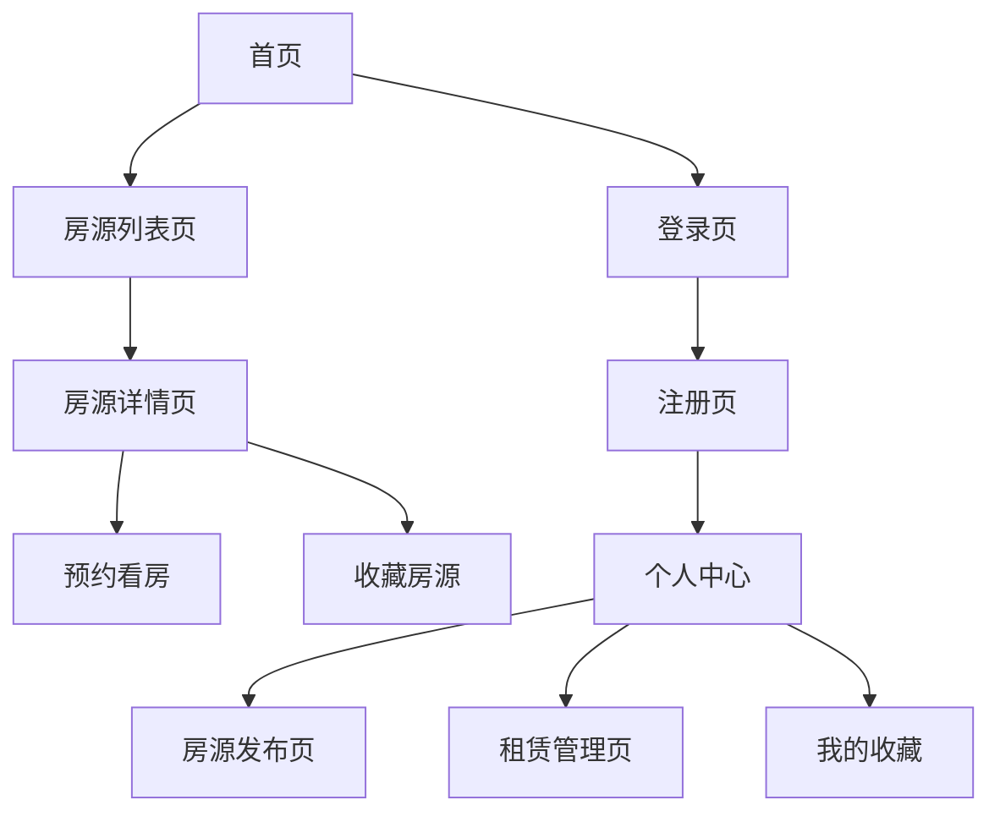

## 1. 产品概述
租房平台是一个连接租客与房东的在线房屋租赁服务平台。通过数字化手段简化租房流程，提供安全、便捷的租房体验。

平台主要解决传统租房过程中的信息不对称、效率低下、安全风险等问题，为租客提供真实可靠的房源信息，为房东提供高效的房源管理工具。

## 2. 核心功能

### 2.1 用户角色
| 角色 | 注册方式 | 核心权限 |
|------|----------|----------|
| 租客 | 邮箱/手机号注册 | 浏览房源、搜索筛选、预约看房、发起租赁申请、支付租金、评价房东 |
| 房东 | 邮箱/手机号注册+身份认证 | 发布房源、管理房源信息、处理租赁申请、管理租金、查看租客信息 |
| 管理员 | 后台创建 | 用户管理、房源审核、订单管理、数据统计、系统设置 |

### 2.2 功能模块
租房平台包含以下主要页面：
1. **首页**: 房源推荐、搜索入口、热门区域、平台介绍
2. **房源列表页**: 搜索筛选、房源卡片展示、地图找房
3. **房源详情页**: 房源信息、图片展示、房东信息、预约看房
4. **用户登录/注册页**: 账号密码登录、手机号注册、身份选择
5. **个人中心**: 个人信息、我的收藏、租赁订单、消息通知
6. **房源发布页**: 房源信息填写、图片上传、价格设置
7. **租赁管理页**: 租赁申请、合同管理、支付记录

### 2.3 页面详情
| 页面名称 | 模块名称 | 功能描述 |
|----------|----------|----------|
| 首页 | 搜索栏 | 输入位置、价格范围、户型等条件进行房源搜索 |
| 首页 | 推荐房源 | 基于用户偏好和地理位置推荐优质房源 |
| 首页 | 热门区域 | 展示热门租房区域的快捷入口 |
| 房源列表页 | 筛选器 | 按价格、户型、面积、朝向等条件筛选房源 |
| 房源列表页 | 房源卡片 | 展示房源缩略图、价格、位置、户型等核心信息 |
| 房源列表页 | 地图模式 | 在地图上标注房源位置，支持区域选择 |
| 房源详情页 | 图片画廊 | 轮播展示房源实景图片，支持放大查看 |
| 房源详情页 | 房源信息 | 详细展示价格、面积、户型、配套设施等信息 |
| 房源详情页 | 房东信息 | 展示房东头像、认证状态、其他房源链接 |
| 房源详情页 | 预约看房 | 选择看房时间，填写联系方式提交预约申请 |
| 登录/注册页 | 登录表单 | 邮箱/手机号+密码登录，支持记住密码 |
| 登录/注册页 | 注册表单 | 填写邮箱、手机号、密码，选择用户角色 |
| 个人中心 | 个人信息 | 查看和编辑头像、昵称、联系方式等基本信息 |
| 个人中心 | 我的收藏 | 查看收藏的房源列表，支持取消收藏 |
| 个人中心 | 租赁订单 | 查看租赁申请状态、合同信息、支付记录 |
| 房源发布页 | 基本信息 | 填写房源标题、描述、价格、面积等基本信息 |
| 房源发布页 | 图片上传 | 上传房源照片，支持拖拽排序和预览 |
| 房源发布页 | 位置信息 | 选择房源所在小区，填写详细地址 |
| 租赁管理页 | 申请列表 | 查看收到的租赁申请，支持接受或拒绝 |
| 租赁管理页 | 合同管理 | 查看和管理租赁合同，支持电子签约 |
| 租赁管理页 | 收租管理 | 查看租金收取记录，发起新的租金收取 |

## 3. 核心流程

### 租客流程
用户访问首页 → 搜索/浏览房源 → 查看房源详情 → 预约看房 → 提交租赁申请 → 签订合同 → 支付租金 → 入住评价

### 房东流程
用户注册成为房东 → 发布房源信息 → 处理看房预约 → 审核租赁申请 → 签订合同 → 收取租金 → 管理租客

### 页面导航流程

## 4. 用户界面设计

### 4.1 设计风格
- **主色调**: 蓝色系（#1890ff）体现专业可靠，辅以灰色系（#f5f5f5）营造简洁感
- **按钮样式**: 圆角矩形设计，主要按钮使用主色调，次要按钮使用边框样式
- **字体规范**: 中文使用PingFang SC，英文使用SF Pro Display，标题18-24px，正文14-16px
- **布局风格**: 卡片式布局，信息层级清晰，留白适当
- **图标风格**: 使用线性图标，保持视觉一致性

### 4.2 页面设计概述
| 页面名称 | 模块名称 | UI元素 |
|----------|----------|----------|
| 首页 | 搜索栏 | 白色背景，蓝色搜索按钮，输入框带有位置图标，支持热门搜索标签 |
| 首页 | 推荐房源 | 横向卡片滑动，每张卡片包含房源图片、价格标签、位置信息 |
| 房源列表页 | 筛选器 | 侧边抽屉式设计，复选框和滑块组合，支持多条件组合筛选 |
| 房源详情页 | 图片画廊 | 全宽轮播图，支持手势滑动，缩略图导航 |
| 房源详情页 | 信息卡片 | 白色圆角卡片，信息分块展示，使用图标增强识别性 |
| 登录页 | 登录表单 | 居中卡片布局，社交登录按钮，支持扫码登录 |
| 个人中心 | 功能入口 | 宫格布局，图标+文字，点击区域充足 |

### 4.3 响应式设计
- **桌面端**: 1200px以上宽度，采用左右分栏布局，功能完整展示
- **平板端**: 768px-1199px宽度，采用上下布局，适当隐藏次要功能
- **移动端**: 767px以下宽度，采用单列布局，核心功能优先，支持触摸手势操作

### 4.4 交互规范
- **加载状态**: 使用骨架屏和旋转加载动画
- **反馈机制**: 操作成功使用绿色提示，失败使用红色警告
- **手势支持**: 移动端支持左滑删除、下拉刷新、上拉加载更多
- **过渡动画**: 页面切换使用淡入淡出，卡片hover使用微动效