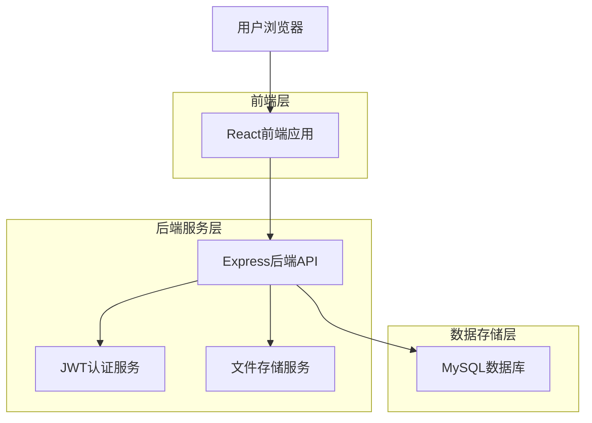
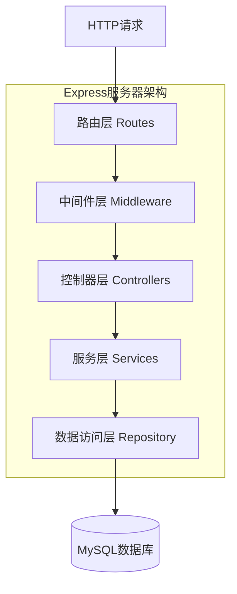
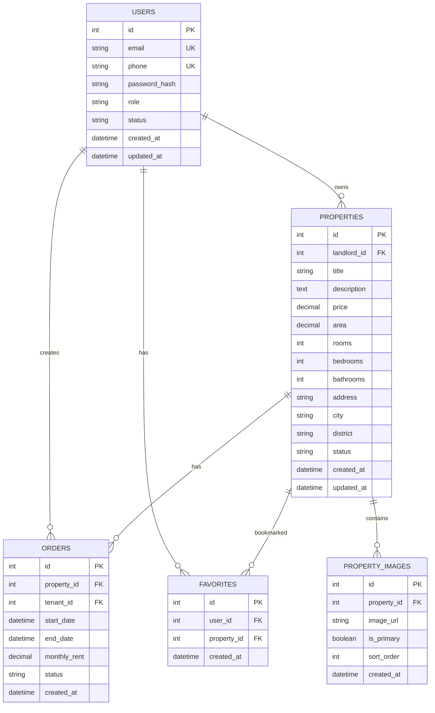
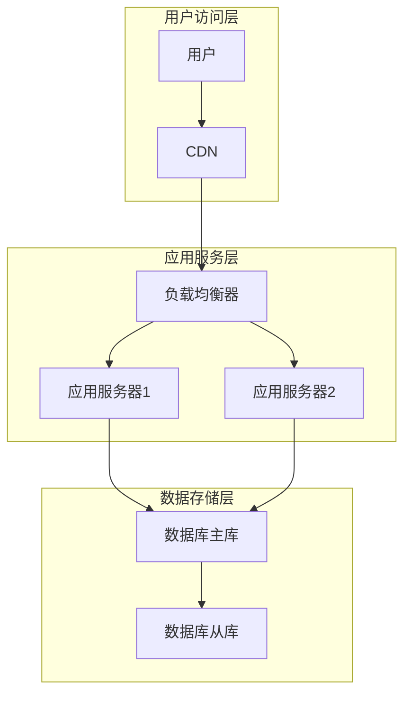

## 1. 架构设计



## 2. 技术栈描述

- **前端**: React@19.2.0 + TypeScript@5.9.3 + Vite@7.2.2
- **后端**: Express@5.1.0 + TypeScript@5.9.3 + Node.js
- **数据库**: MySQL@8.0 + MySQL2驱动
- **认证**: JWT(jsonwebtoken@9.0.2) + bcryptjs@3.0.3
- **数据验证**: Zod@4.1.12
- **HTTP客户端**: Axios@1.13.2
- **开发工具**: ts-node-dev(热重载)

## 3. 路由定义

### 前端路由
| 路由路径 | 页面组件 | 功能描述 |
|----------|----------|----------|
| / | HomePage | 首页，展示推荐房源和搜索入口 |
| /login | LoginPage | 用户登录页面 |
| /register | RegisterPage | 用户注册页面 |
| /properties | PropertyListPage | 房源列表页面，支持搜索筛选 |
| /properties/:id | PropertyDetailPage | 房源详情页面 |
| /profile | ProfilePage | 个人中心页面 |
| /profile/properties | MyPropertiesPage | 我的房源管理 |
| /profile/orders | MyOrdersPage | 我的租赁订单 |
| /property/publish | PublishPropertyPage | 发布房源页面 |
| /property/edit/:id | EditPropertyPage | 编辑房源页面 |

### 后端API路由
| 路由路径 | HTTP方法 | 功能描述 |
|----------|----------|----------|
| /api/auth/register | POST | 用户注册 |
| /api/auth/login | POST | 用户登录 |
| /api/auth/profile | GET | 获取用户信息 |
| /api/auth/profile | PUT | 更新用户信息 |
| /api/properties | GET | 获取房源列表 |
| /api/properties | POST | 发布新房源 |
| /api/properties/:id | GET | 获取房源详情 |
| /api/properties/:id | PUT | 更新房源信息 |
| /api/properties/:id | DELETE | 删除房源 |
| /api/properties/search | GET | 搜索房源 |
| /api/orders | GET | 获取订单列表 |
| /api/orders | POST | 创建新订单 |
| /api/orders/:id | GET | 获取订单详情 |
| /api/orders/:id | PUT | 更新订单状态 |
| /api/upload/image | POST | 上传图片 |

## 4. API接口定义

### 4.1 认证相关API

#### 用户注册
```
POST /api/auth/register
```

请求参数：
| 参数名 | 类型 | 必填 | 描述 |
|--------|------|------|------|
| email | string | 是 | 用户邮箱 |
| phone | string | 否 | 手机号 |
| password | string | 是 | 密码(至少6位) |
| role | string | 是 | 用户角色(tenant/landlord) |

响应示例：
```json
{
  "token": "eyJhbGciOiJIUzI1NiIsInR5cCI6IkpXVCJ9...",
  "user": {
    "id": 1,
    "email": "user@example.com",
    "role": "tenant"
  }
}
```

#### 用户登录
```
POST /api/auth/login
```

请求参数：
| 参数名 | 类型 | 必填 | 描述 |
|--------|------|------|------|
| email | string | 是 | 用户邮箱 |
| password | string | 是 | 密码 |

### 4.2 房源相关API

#### 获取房源列表
```
GET /api/properties?page=1&limit=10&city=北京&price_min=1000&price_max=5000
```

查询参数：
| 参数名 | 类型 | 必填 | 描述 |
|--------|------|------|------|
| page | number | 否 | 页码，默认1 |
| limit | number | 否 | 每页数量，默认10 |
| city | string | 否 | 城市 |
| price_min | number | 否 | 最低价格 |
| price_max | number | 否 | 最高价格 |
| rooms | number | 否 | 房间数 |
| area_min | number | 否 | 最小面积 |
| area_max | number | 否 | 最大面积 |

#### 发布房源
```
POST /api/properties
```

请求体：
| 参数名 | 类型 | 必填 | 描述 |
|--------|------|------|------|
| title | string | 是 | 房源标题 |
| description | string | 是 | 房源描述 |
| price | number | 是 | 月租金 |
| area | number | 是 | 建筑面积 |
| rooms | number | 是 | 房间数 |
| address | string | 是 | 详细地址 |
| images | array | 是 | 图片URL数组 |
| facilities | array | 否 | 配套设施 |

### 4.3 订单相关API

#### 创建租赁订单
```
POST /api/orders
```

请求体：
| 参数名 | 类型 | 必填 | 描述 |
|--------|------|------|------|
| property_id | number | 是 | 房源ID |
| start_date | string | 是 | 租赁开始日期 |
| end_date | string | 是 | 租赁结束日期 |
| tenant_name | string | 是 | 租客姓名 |
| tenant_phone | string | 是 | 租客电话 |

## 5. 服务器架构



### 5.1 分层职责
- **路由层**: 定义API端点，请求转发到对应控制器
- **中间件层**: 身份验证、请求日志、错误处理、CORS配置
- **控制器层**: 处理HTTP请求，调用服务层，返回响应
- **服务层**: 业务逻辑处理，数据验证，调用数据访问层
- **数据访问层**: 数据库操作，执行SQL查询

## 6. 数据模型设计

### 6.1 数据库实体关系图



### 6.2 数据表定义

#### 用户表 (users)
```sql
CREATE TABLE users (
    id INT PRIMARY KEY AUTO_INCREMENT,
    email VARCHAR(255) UNIQUE NOT NULL,
    phone VARCHAR(20) UNIQUE,
    password_hash VARCHAR(255) NOT NULL,
    role ENUM('tenant','landlord','admin') NOT NULL,
    status ENUM('active','inactive') DEFAULT 'active',
    avatar_url VARCHAR(500),
    nickname VARCHAR(100),
    created_at TIMESTAMP DEFAULT CURRENT_TIMESTAMP,
    updated_at TIMESTAMP DEFAULT CURRENT_TIMESTAMP ON UPDATE CURRENT_TIMESTAMP,
    INDEX idx_email (email),
    INDEX idx_phone (phone)
);
```

#### 房源表 (properties)
```sql
CREATE TABLE properties (
    id INT PRIMARY KEY AUTO_INCREMENT,
    landlord_id INT NOT NULL,
    title VARCHAR(200) NOT NULL,
    description TEXT,
    price DECIMAL(10,2) NOT NULL,
    area DECIMAL(8,2) NOT NULL,
    rooms INT NOT NULL,
    bedrooms INT NOT NULL,
    bathrooms INT NOT NULL,
    address VARCHAR(500) NOT NULL,
    city VARCHAR(100) NOT NULL,
    district VARCHAR(100) NOT NULL,
    latitude DECIMAL(10,8),
    longitude DECIMAL(11,8),
    status ENUM('available','rented','offline') DEFAULT 'available',
    facilities JSON,
    created_at TIMESTAMP DEFAULT CURRENT_TIMESTAMP,
    updated_at TIMESTAMP DEFAULT CURRENT_TIMESTAMP ON UPDATE CURRENT_TIMESTAMP,
    FOREIGN KEY (landlord_id) REFERENCES users(id),
    INDEX idx_city_district (city, district),
    INDEX idx_price (price),
    INDEX idx_status (status)
);
```

#### 订单表 (orders)
```sql
CREATE TABLE orders (
    id INT PRIMARY KEY AUTO_INCREMENT,
    property_id INT NOT NULL,
    tenant_id INT NOT NULL,
    landlord_id INT NOT NULL,
    start_date DATE NOT NULL,
    end_date DATE NOT NULL,
    monthly_rent DECIMAL(10,2) NOT NULL,
    deposit DECIMAL(10,2) NOT NULL,
    status ENUM('pending','approved','rejected','active','completed','cancelled') DEFAULT 'pending',
    tenant_message TEXT,
    landlord_note TEXT,
    created_at TIMESTAMP DEFAULT CURRENT_TIMESTAMP,
    updated_at TIMESTAMP DEFAULT CURRENT_TIMESTAMP ON UPDATE CURRENT_TIMESTAMP,
    FOREIGN KEY (property_id) REFERENCES properties(id),
    FOREIGN KEY (tenant_id) REFERENCES users(id),
    FOREIGN KEY (landlord_id) REFERENCES users(id),
    INDEX idx_tenant_id (tenant_id),
    INDEX idx_landlord_id (landlord_id),
    INDEX idx_status (status)
);
```

#### 收藏表 (favorites)
```sql
CREATE TABLE favorites (
    id INT PRIMARY KEY AUTO_INCREMENT,
    user_id INT NOT NULL,
    property_id INT NOT NULL,
    created_at TIMESTAMP DEFAULT CURRENT_TIMESTAMP,
    FOREIGN KEY (user_id) REFERENCES users(id),
    FOREIGN KEY (property_id) REFERENCES properties(id),
    UNIQUE KEY uk_user_property (user_id, property_id),
    INDEX idx_user_id (user_id)
);
```

#### 房源图片表 (property_images)
```sql
CREATE TABLE property_images (
    id INT PRIMARY KEY AUTO_INCREMENT,
    property_id INT NOT NULL,
    image_url VARCHAR(500) NOT NULL,
    is_primary BOOLEAN DEFAULT FALSE,
    sort_order INT DEFAULT 0,
    created_at TIMESTAMP DEFAULT CURRENT_TIMESTAMP,
    FOREIGN KEY (property_id) REFERENCES properties(id) ON DELETE CASCADE,
    INDEX idx_property_id (property_id)
);
```

### 6.3 初始数据

```sql
-- 创建管理员账户
INSERT INTO users (email, phone, password_hash, role, status) 
VALUES ('admin@rental.com', '13800138000', '$2a$10$92IXUNpkjO0rOQ5byMi.Ye4oKoEa3Ro9llC/.og/at2.uheWG/igi', 'admin', 'active');

-- 创建测试房东账户
INSERT INTO users (email, phone, password_hash, role, status, nickname) 
VALUES ('landlord@example.com', '13900139000', '$2a$10$92IXUNpkjO0rOQ5byMi.Ye4oKoEa3Ro9llC/.og/at2.uheWG/igi', 'landlord', 'active', '张房东');

-- 创建测试租客账户  
INSERT INTO users (email, phone, password_hash, role, status, nickname) 
VALUES ('tenant@example.com', '13700137000', '$2a$10$92IXUNpkjO0rOQ5byMi.Ye4oKoEa3Ro9llC/.og/at2.uheWG/igi', 'tenant', 'active', '李租客');
```

## 7. 部署和运维方案

### 7.1 环境配置

#### 开发环境
```bash
# 前端开发
npm run dev

# 后端开发  
npm run dev
```

#### 生产环境
```bash
# 前端构建
npm run build

# 后端构建
npm run build
npm run start
```

### 7.2 环境变量配置

#### 后端环境变量 (.env)
```
NODE_ENV=production
PORT=3001
JWT_SECRET=your-secret-key-here
DB_HOST=localhost
DB_PORT=3306
DB_NAME=rental_app
DB_USER=root
DB_PASSWORD=your-password
UPLOAD_PATH=./uploads
MAX_FILE_SIZE=5242880
```

#### 前端环境变量 (.env.production)
```
VITE_API_URL=http://your-domain.com/api
VITE_UPLOAD_URL=http://your-domain.com/upload
```

### 7.3 部署架构



### 7.4 监控和日志

- **应用监控**: PM2进程管理，监控CPU、内存使用率
- **错误日志**: Winston日志库，按日期分割存储
- **性能监控**: 接口响应时间统计，慢查询监控
- **安全监控**: 登录失败次数统计，异常访问IP封禁

### 7.5 备份策略

- **数据库备份**: 每日凌晨2点自动备份，保留30天
- **文件备份**: 用户上传图片定期备份到云存储
- **代码备份**: Git版本控制，多分支管理策略